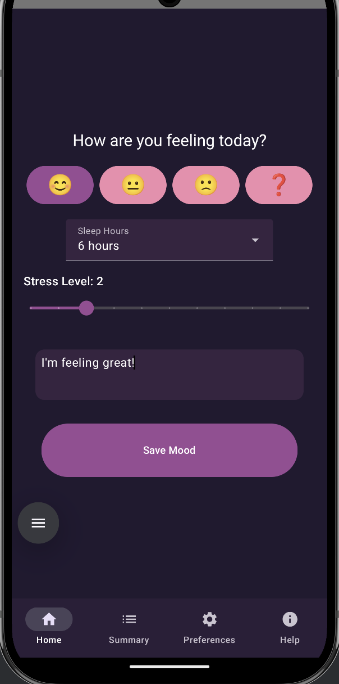
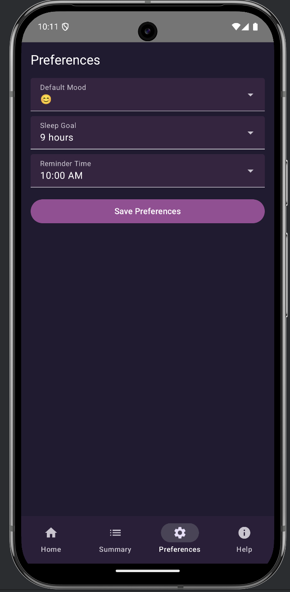
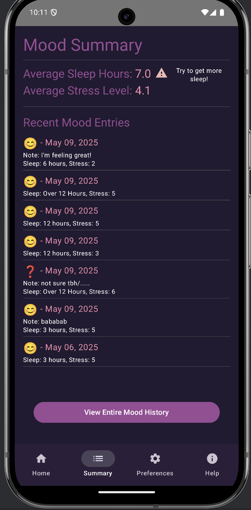
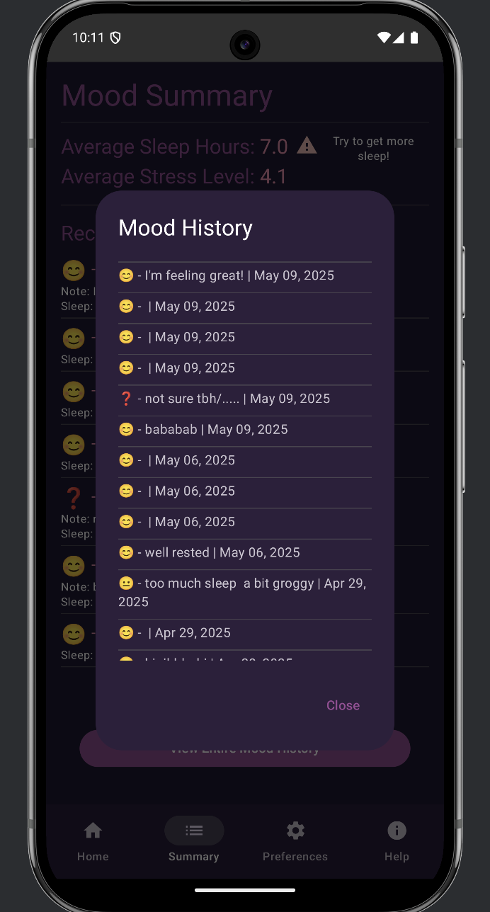
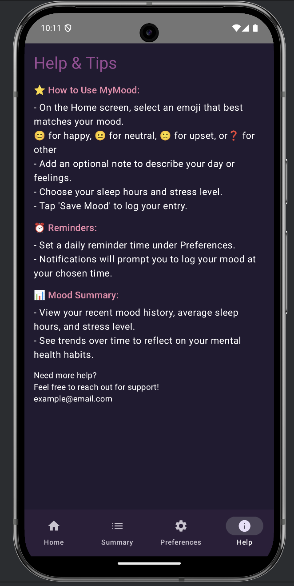

# 📱 MyMood App

A simple, engaging Android app that helps users track their daily mood, sleep, and stress levels over time. Built using Kotlin, Jetpack Compose, Room database, and WorkManager.

---

## ✨ Features

- Log daily moods using emoji buttons.
- Track sleep hours and stress levels.
- View a mood summary, including:
    - Recent mood entries
    - Average sleep
    - Average stress
- Set preferences for:
    - Default mood
    - Sleep goal
    - Daily reminder notification time
- Receive daily notifications to log mood.
- Helpful information provided in the Help section.

---

## App Structure

| Activity            | Description |
|---------------------|-------------|
| **Main Activity**    | Mood logging screen (entry point of the app). |
| **Preferences Activity** | Set default mood, sleep goal, and notification time. Preferences are stored persistently. |
| **Secondary Activity (DataDisplayScreen)** | Displays mood history, averages, and most common mood. Data flows from Main Activity. |
| **Help Activity**    | Provides information about the app and how preferences affect behavior. Display only, no interaction required. |

---

## 🛠️Technologies Used
- Kotlin
- Jetpack Compose
- Room Database
- ViewModel + StateFlow (for state management)
- SharedPreferences (for saving user preferences)
- WorkManager (for daily reminders)
- Snackbar Notifications
- Android 13+ (with POST_NOTIFICATIONS permission handling)

---

## 📸Screenshots

### Home Screen


### Preferences Screen


### Mood Summary Screen (Recent Entries)


### Mood Summary Screen (All Entries)


### Help Screen


---

## 🚀 How to Run the App

1. Clone the repository:
   ```bash
   git clone https://github.com/seneiya0/MyMoodApp.git
   ```

2. Open the project in **Android Studio**.

3. Build and run the app on an **emulator or physical device** (API 30+ recommended).

4. **Accept notification permissions** when prompted, to allow daily mood reminder notifications.

---

## 📋 Future Improvement Ideas

- Allow editing of mood entries after submission.
- Display charts or graphs to visualize mood trends over time.
- Customizable notification sounds.
- Theme customization.

---

## Notes
- Preferences (like reminder time) update the notification schedule automatically.
- No sensitive user data is stored or shared.

---